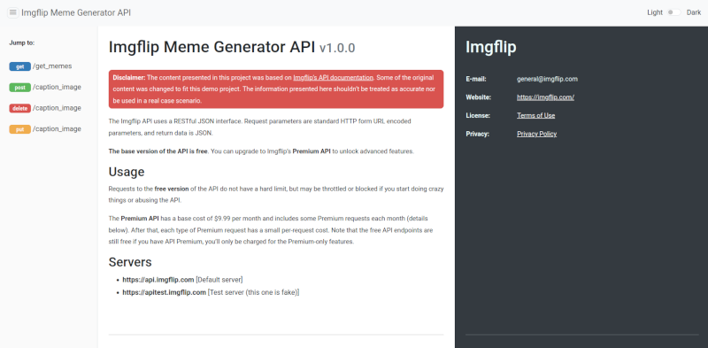

# Jekyll OpenAPI Parser: a Jekyll template for API docs

**Jekyll OpenAPI Parser** is a template for Jekyll that generates API reference documentation from an OpenAPI specification file (OAS v3.0).

This is a test project and it currently doesn't have full OAS support. (See [Template limitations](#template-limitations))

## Quickstart

1. Clone this repository.

1. Run the following command in a terminal to build the project and start the local server:

    ```
    # bundle exec jekyll serve
    ```

1. View the reference documentation website at `http://localhost:4000`.



## Requirements

* **Ruby with DevKit**
    * Linux - apt (Debian or Ubuntu):
    ```
    $ sudo apt-get install ruby-full
    ```
    Or check out [this installation guide for other distros](https://www.ruby-lang.org/en/documentation/installation/).

    * Windows: use [Ruby Installer](https://rubyinstaller.org/)
* **Jekyll + Bundler**
    ```
    $ gem install jekyll bundler
    ```

## About this project

### Features

* Iterates a YAML file written in OpenAPI 3.0
* Methods (descriptions and request bodies)
* Responses (error code, description, model/schema and example)
* Three-panel format
* Collapsible sidebar
* Light and dark mode
* Fully responsive
* Includes a sample YAML file
    * The sample file is based on [ImgFlip's Meme Generator API documentation](https://imgflip.com/api). This file was created for demonstration only and it does not represent ImgFlip's official API.

### Usage

This template uses Jekyll's built-in Liquid integration to iterate through the specification file and generate the docs.

* Put the YAML file in the `_data` folder. You can use the project's default file or provide your own.
* Set the name of your specification file in the `data_source` variable located in the `reference.html` file, *without* the extension.
    * *Example:*

        Specification file: `meme_generator.yaml`

        Variable:
    
            

### Template limitations

The current version of this template does *not* support:

* JSON files
* Multiple YAML files
* Every OpenAPI feature, such as References (`$ref`) and other things

## License

[Jekyll OpenAPI Parser](https://github.com/james-sabel/jekyll-openapi-parser) © 2024 by [James Sabel](https://github.com/james-sabel) is licensed under [CC BY-NC-SA 4.0](https://creativecommons.org/licenses/by-nc-sa/4.0/?ref=chooser-v1) (Creative Commons Attribution-NonCommercial-ShareAlike 4.0 International).

**This license requires that reusers give credit to the creator. It allows reusers to distribute, remix, adapt, and build upon the material in any medium or format, for noncommercial purposes only. If others modify or adapt the material, they must license the modified material under identical terms.**

## Contributions

Feel free to suggest fixes and improvements. You can also fork this repository and send your own pull requests.

When contributing, try to follow the [Contributor Covenant](https://www.contributor-covenant.org/) guidelines.